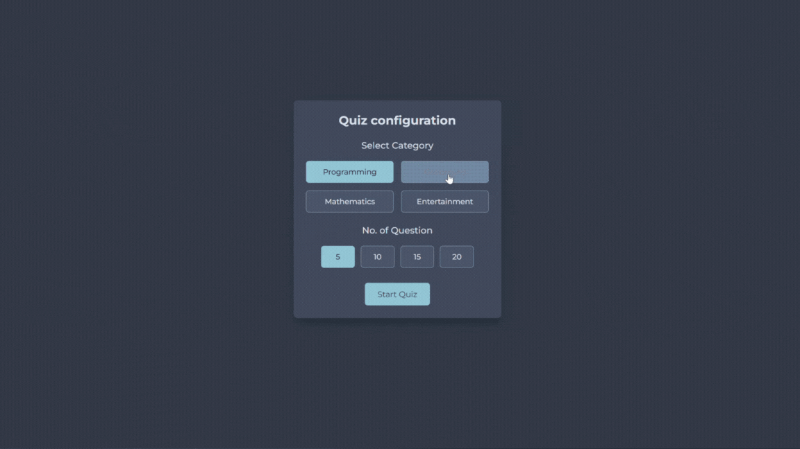

# QuizApp 🎓❓

A web-based multiple-choice quiz built from scratch to explore how quiz platforms (like Google Forms) handle **questions, timers, validation, and results**.

---

## 📖 About This Project
I wanted to understand the inner workings of quiz systems—how they validate inputs, handle timing, and display results—so I built this project using **HTML, CSS, and JavaScript**.

---

## ✨ Features
- 🗂️ Category selection (Programming, Geography, Math, etc.)
- 🔢 Choose number of questions (5, 10, 15, or 20)
- ⏱️ 15-second timer per question
- ✅ Instant validation on answers
- 📊 Final score display with "Try Again" option

---

## 🎮 Try It Yourself!
Want to test it live?  

👉 [**Play QuizApp Online**](https://ridhwanhazian.github.io/QuizApp/)

---

### 📸 Demo Preview
<p align="center">
  
</p>

---

## 🚀 Run Locally
Clone this repository and open `index.html` in your browser:

```bash
git clone https://github.com/RidhwanHazian/QuizApp.git
cd QuizApp
open index.html
